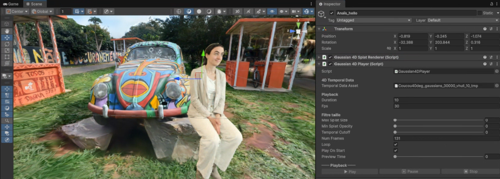
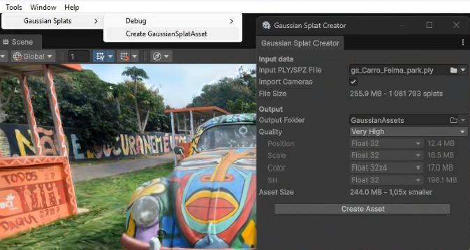

# 4D Gaussian Splatting playground in Unity

This project extends [aras-p/UnityGaussianSplatting](https://github.com/aras-p/UnityGaussianSplatting) — a
realtime Gaussian Splatting visualization plugin for Unity — with support for **4D Gaussian
Splatting** (temporal, dynamic scenes), while keeping full compatibility with the original 3D
static workflow. A single project can freely mix a static 3D-splat environment with one or more
animated 4D-splat actors, rendered together in the same scene.

⚠️ This is a research/production tool built for internal use at French Touch Factory / ITHACA,
shared here for anyone who might find it useful. It is not officially supported by Aras
Pranckevičius or Unity Technologies.

⚠️ Same platform requirements as the original project: **DX12 or Vulkan on Windows, DX11 will
not work.** Not tested on mobile or web.

## Usage

Clone or download this repository, open it as a Unity project (**Unity 6 / 6000.0.77f1**,
Universal Render Pipeline — "Universal 3D" template), and open the sample scene under
`Assets/Scenes/`.

### Installing in an existing project

Copy the `Packages/com.frenchtouchfactory.ithaca-4dgs/` folder into your own project's
`Packages/` directory.

### Installing via Package Manager (Git URL)

Alternatively, install directly from this repository without cloning it: in your project, open
`Window > Package Manager`, click the **+** button → **Install package from git URL...**, and
paste:

https://github.com/frenchtouchXR/ithaca-4dgs-unity.git?path=/Packages/com.frenchtouchfactory.ithaca-4dgs

This requires a Git client (2.14.0+) installed and available on your system `PATH`. Once
installed, a **Demo Scene** sample is available from the package's page in Package Manager
(**Samples** section) — click **Import** to add it to your project. As with the sample scene
in this repository, it references Gaussian Splat assets that must be generated separately;
see [Demo assets](#demo-assets) below.

### Render Pipeline setup

Both the 3D and the 4D rendering paths are implemented as separate URP Renderer Features, and
**both must be added** to your active Renderer asset (`Project Settings > Graphics` → Pipeline
Asset → Renderer → **Renderer Features**):

- `GaussianSplatURPFeature` — static 3D splats (unmodified from aras-p)
- `Gaussian4DURPFeature` — animated 4D splats

`GaussianSplatURPFeature` must be listed **before** `Gaussian4DURPFeature`, otherwise occlusion
between a 3D environment and a 4D actor will be incorrect.

### Demo assets

The sample scene included in this repository references Gaussian Splat assets that are too
large to store in Git. Download them here:
[Demo assets (Google Drive)](https://drive.google.com/file/d/1DrsaGNzCFkl63uh62_RSAf4FhUCFAp24/view?usp=sharing).

Extract the archive's PLY files into `Assets/GS_scenes/` at the root of the project (create
the folder if needed), then generate the corresponding GaussianSplat assets yourself using
`Gaussian Splat > Create GaussianSplat Asset` (see below) before opening the sample scene.

### Creating a Gaussian Splat asset

Open `Gaussian Splat > Create GaussianSplat Asset` from the Unity menu. Point **Input PLY File**
to your Gaussian Splat file:

- A regular static PLY (from the original 3DGS paper, or any compatible tool) produces a
  standard 3D asset, usable with either `GaussianSplatRenderer` (3D, aras-p) or
  `Gaussian4DSplatRenderer` (4D) in static mode.
- A **temporal** PLY — one containing the extra per-splat attributes `t`, `scale_t`,
  `rot_r_0..3` (produced by a compatible 4D Gaussian Splatting training pipeline) — also
  generates a `*_tmp.bytes` temporal data file alongside the regular asset, enabling animated
  playback.

### Setting up a 4D actor

- Add a `Gaussian4DSplatRenderer` component to a GameObject. Its shader and compute shader
  references are **auto-populated** on add.
- Assign your **Asset** field.
- Add a `Gaussian4DPlayer` component — it auto-links the asset's temporal data, and exposes
  Play / Pause / Stop, looping, and a `Preview Time` scrubber usable directly in the editor.
- Set the GameObject's **`Scale.y` to `-1`** — Gaussian Splat scenes are authored in COLMAP's
  right-handed coordinate system; this axis flip is the correct way to bring them into Unity's
  left-handed space (a rotation cannot fix a coordinate-system mirroring).

A static 3D environment can be set up the same way as in the original aras-p project, using the
regular `GaussianSplatRenderer` component, and will correctly occlude / be occluded by 4D
actors in the same scene.

**Note:** leave `SH Only` unchecked on `Gaussian4DSplatRenderer` — it's a debug visualization
mode that isolates the spherical-harmonics contribution and forces a grayscale render.

## Known limitations

Only the **VeryHigh** asset quality preset is currently validated for temporal (4D) assets.
Compressed presets (Medium, Low, High) quantize position/rotation/scale data, which appears to
interact badly with the temporal covariance computation and can produce chaotic, jumbled
geometry. Use VeryHigh when generating a temporal asset until this is investigated further.

## What's different from the original project

| Area | Change |
|---|---|
| Rendering | New `Gaussian4DSplatRenderer` / `Gaussian4DURPFeature` / `Splat4DUtilities.compute`, implementing per-splat temporal displacement and conditional covariance, alongside the unmodified 3D path |
| Playback | New `Gaussian4DPlayer` component: GPU upload of temporal data, Play/Pause/Stop/loop, editor preview scrubbing |
| Asset pipeline | `GaussianFileReader` and `GaussianSplatAssetCreator` read the extra temporal PLY attributes and emit a companion `*_tmp.bytes` file |
| Namespacing | Everything lives under `GaussianSplatting4D.*` instead of `GaussianSplatting.*`, so both plugins can be installed side by side |

## License and External Code Used

The code in this repository is under MIT license, same as the original project. See
[`Packages/com.frenchtouchfactory.ithaca-4dgs/LICENSE.md`](Packages/com.frenchtouchfactory.ithaca-4dgs/LICENSE.md).

This is a fork of [aras-p/UnityGaussianSplatting](https://github.com/aras-p/UnityGaussianSplatting)
(MIT license, © Aras Pranckevičius and contributors), extended by French Touch Factory / ITHACA
with 4D Gaussian Splatting support.

As with the original project: keep in mind that the license of the original 3DGS paper
implementation states that the official *training* software is for educational / academic /
non-commercial purposes; commercial usage requires a separate license from INRIA. Even though
this Unity viewer/integration is MIT-licensed, how you obtained your Gaussian Splat PLY files
is a separate consideration.

---
French Touch Factory / ITHACA — [github.com/frenchtouchXR](https://github.com/frenchtouchXR)
